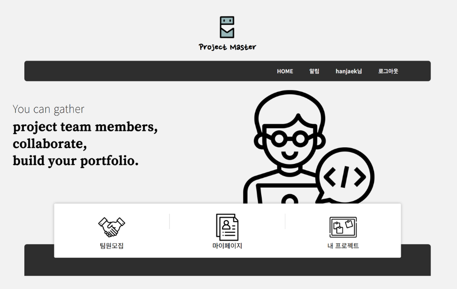
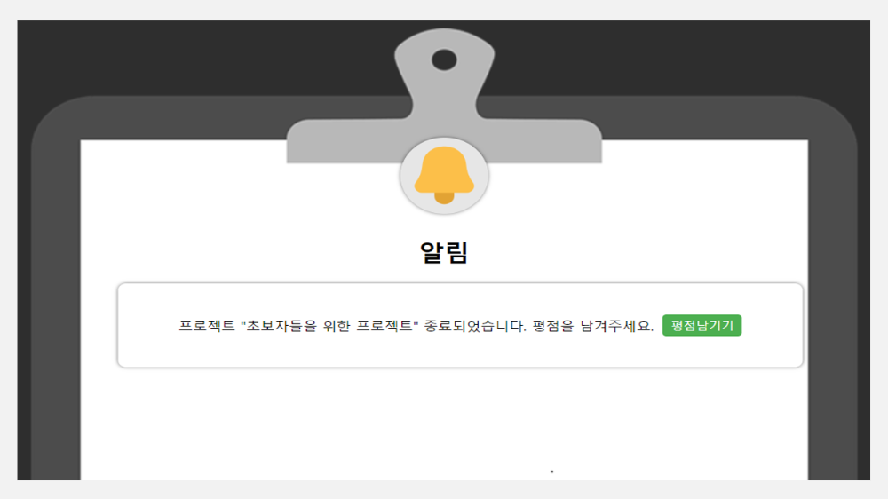
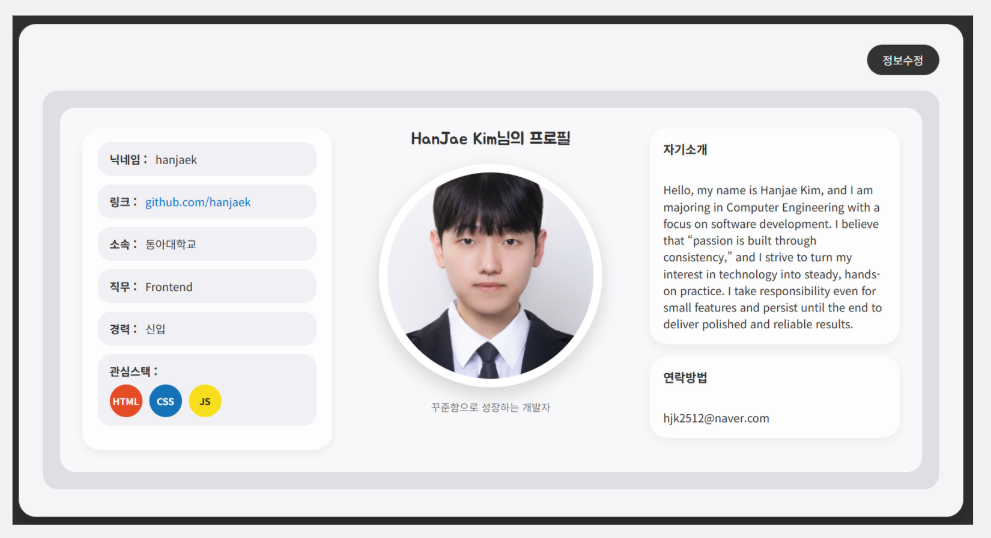
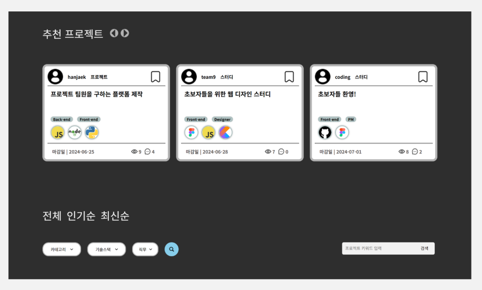
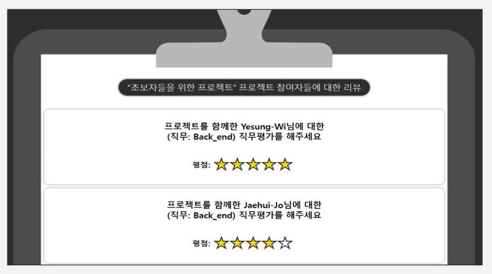
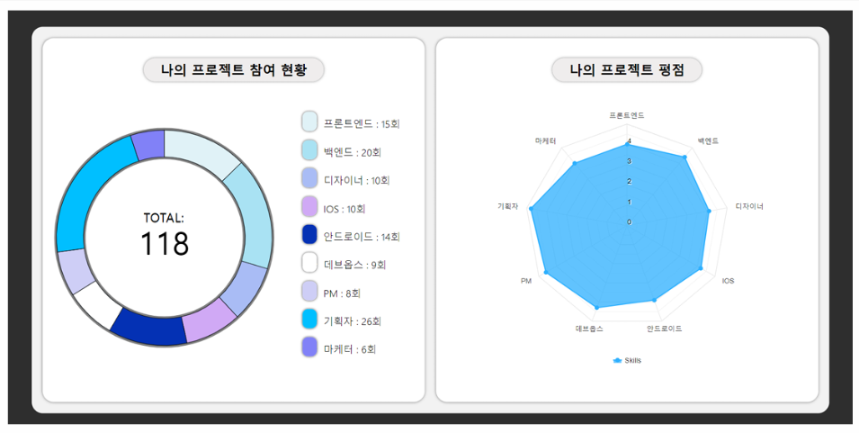

 

## 🤝🏻 프로젝트와 스터디를 함께할 팀원을 모집할 수 있습니다.
- 프로젝트를 함께할 팀원을 모집하고 싶으신가요?
- 신뢰성을 있는 프로젝트를 하고 싶으신가요?
- 나만의 포트폴리오를 제작하고 싶으신가요?
 
 

## 💻 Project Master에서 함께하세요!
- 여러 팀원들과 프로젝트를 함께 할 수 있습니다
- 프로젝트를 진행하며 나의 평점을 올려보아요
- 평점을 기반으로 나의 포트폴리오를 만들 수 있어요

 

---

 

## 📸 주요 페이지 소개

| | | |
|:---:|:---:|:---:|
|  |  |  |
|  |  |  |

 

## 📖 기술 스택
 

|분야|사용 기술|
|:-----:|:--------------:|
|FrontEnd|HTML, CSS, JavaScript|
|BackEnd|Node.js, Flask(Python)|
|DataBase|MySQL|
|TOOL|VSCode|
|Version Management|GitHub|

 

## 🖇️ 아키텍처

 

## 🥇 함께한 팀원

|학번|이름|깃허브|
|:----:|:---:|:-----:|
|2024482|김한재|Kimhanjae7|
|2023770|박지원|G1|
|2023734|위예성|yesung20|
|2022546|조재희|zozayx|
|2023874|최혁진|HyeokJin-Choi|

 
 

## 🔖 참고문헌
- https://holaworld.io/
- https://github.com/githiro/drawDoughnutChart
- https://code.highcharts.com/highcharts-more.js
- https://code.highcharts.com/highcharts.js 
